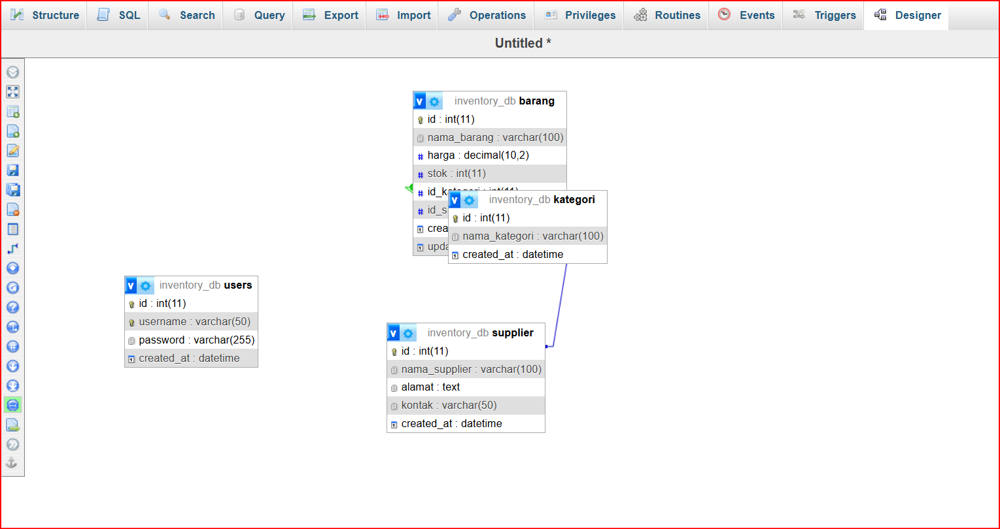

# UAS_Web2_312410058_Wahyupahrudin

# 📦 Sistem Manajemen Inventaris Barang (E-Inventory)

## 📌 Deskripsi Proyek

Sistem Manajemen Inventaris Barang (E-Inventory) merupakan aplikasi berbasis web yang digunakan untuk mengelola data inventaris meliputi data barang, kategori, dan supplier.

Aplikasi dikembangkan menggunakan konsep **Decoupled Architecture (Arsitektur Terpisah)** dengan memisahkan Backend dan Frontend secara penuh.

Backend dibangun menggunakan **CodeIgniter 4 sebagai RESTful API Server**, sedangkan Frontend menggunakan **VueJS 3 berbasis CDN dengan pendekatan Single Page Application (SPA)**.

---

# ⚙️ Teknologi yang Digunakan

## Backend

* PHP
* CodeIgniter 4
* RESTful API
* JWT Authentication
* MySQL / MariaDB

## Frontend

* VueJS 3 (CDN)
* Vue Router
* Axios
* TailwindCSS

---

# 🗄️ Struktur Database

Relasi tabel yang digunakan:

* barang
* kategori
* supplier

### 📸 Screenshot Relasi Database
 
 


# 🔐 Uji Coba Proteksi API (401 Unauthorized)

Pengujian endpoint dilakukan menggunakan Postman.

Skenario pengujian:

* Login berhasil → mendapatkan token
* Request tanpa Authorization Bearer Token → akses ditolak
* Server mengembalikan status **401 Unauthorized**

# Tampilan eror 401


# Tampilan saat menggunakan token :
 

---      

# 💻 Tampilan Aplikasi

## Halaman Login !


---

## Dashboard Administrator


---

## Form Tambah / Edit Data (Modal)


---

## Tabel Data Inventaris


# Data Kategori

---

# Data Supplier


---

# 🚀 Cara Menjalankan Project

## 1. Clone Repository

```bash
git clone [LINK_REPOSITORY]
```

---

# 🔧 Menjalankan Backend (CodeIgniter 4)

Masuk ke folder backend:

```bash
cd backend-api
```

Install dependency:

```bash
composer install
```

### Konfigurasi File Environment

File `.env` tidak disertakan dalam repository karena digunakan untuk konfigurasi lokal.

Buat file `.env` dengan menyalin file bawaan CodeIgniter:

Windows CMD:

```bash
copy env .env
```

PowerShell:

```bash
Copy-Item env .env
```

Sesuaikan konfigurasi berikut:

```env
CI_ENVIRONMENT = development

app.baseURL = 'http://localhost:8080'

database.default.hostname = localhost
database.default.database = (nama_database)
database.default.username = root
database.default.password =
database.default.port = 3306
```

Jalankan server:

```bash
php spark serve
```

Backend berjalan pada:

```text
http://localhost:8080
```

Endpoint API:

```text
http://localhost:8080/api
```

---

# 🌐 Menjalankan Frontend (VueJS SPA Berbasis CDN)

Buka terminal kemudian masuk ke folder frontend:

```bash
cd frontend-spa
```

Jalankan frontend:

```bash
npx serve .
```

Frontend berjalan pada:

```text
http://localhost:3000
```

Catatan:

Frontend dibangun menggunakan VueJS berbasis CDN sehingga tidak menggunakan proses build seperti Vite.

---

# 🔑 Login Default

Username:

```text
admin
```

Password:

```text
password
```

---

# 📂 Struktur Repository

```text
UAS_Web2_312410058_Wahyupahrudin
│
├── backend-api
├── frontend-spa
├── images
└── README.md
```

---

# 🎥 Video Presentasi

Link YouTube:

(Tambahkan link video presentasi)

---

# 👨‍💻 Dibuat Oleh

Nama: Wahyu Pahrudin
NIM: 312410058
Mata Kuliah: Pemrograman Web 2
